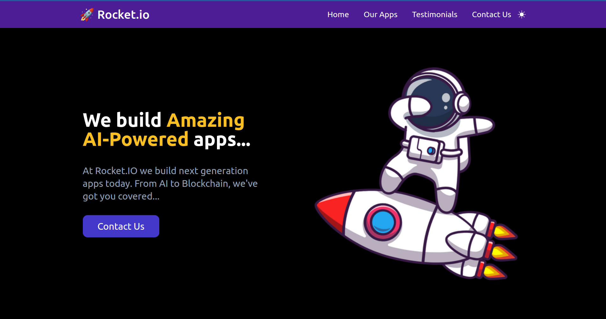
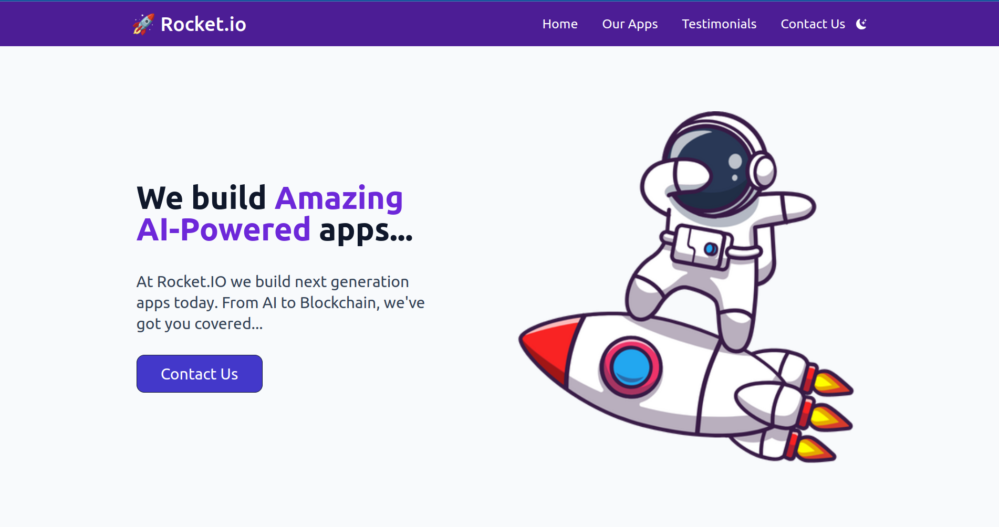

# 🚀Rocket IO - Tailwind CSS

[](https://app.netlify.com/sites/rocket-service/deploys)





---

This is a simple simple landing page for a fictional company called Rocket IO. It is built using Tailwind CSS, HTML and JavaScript.

The Original layout idea and inspiration is from this youtube video: [Tailwind CSS Introduction, Basics & Guided Tutorial by Dave Gray](https://www.youtube.com/watch?v=pYaamz6AyvU).

- I added a few touches of my own like a dark mode toggle button and a few color touches.
- I found the project to be fun and easy to understand for complete beginners in Tailwind CSS.

---

## Basic Setup from Scratch

- In vs code,
  - install the `Tailwind CSS IntelliSense` extension.
  - install the `PostCSS Language Support` extension.
- In the terminal in the project folder (preferably in vs code),
  - run `npm init -y` to initialize the project.
  - run `npm install -D tailwindcss` to install Tailwind CSS.
  - run `npx tailwindcss init` to create a `tailwind.config.js` file.
  - run `npm install -D prettier-plugin-tailwindcss` to install the Tailwind CSS plugin for Prettier.
- Modify the `tailwind.config.js` file as follows:

```js
/** @type {import('tailwindcss').Config} */
module.exports = {
  content: ["./*.html"],
  theme: {
    extend: {},
  },
  plugins: [],
};
```

- modify the `scripts` in the `package.json` file as follows:

```json
{
  "scripts": {
    "build": "tailwind -i ./input.css -o ./css/style.css",
    "watch": "tailwind -i ./input.css -o ./css/style.css --watch"
  }
}
```

- create a `.gitignore` file and add the following:

```gitignore
node_modules
```

---

## Setup using this repository

- Clone the repository.
- In the terminal in the project folder (preferably in vs code),
  - run `npm install` to install the dependencies.
  - run `npm run watch` to start the development server
  - start the `live server` in vs code.

## Useful Links

- [Tailwind CSS](https://tailwindcss.com/)
- [Tailwind CSS Introduction, Basics & Guided Tutorial by Dave Gray on Youtube](https://www.youtube.com/watch?v=pYaamz6AyvU).

## License

This project is licensed under the MIT License. Free to use for your personal portfolio projects.
Happy Coding!
